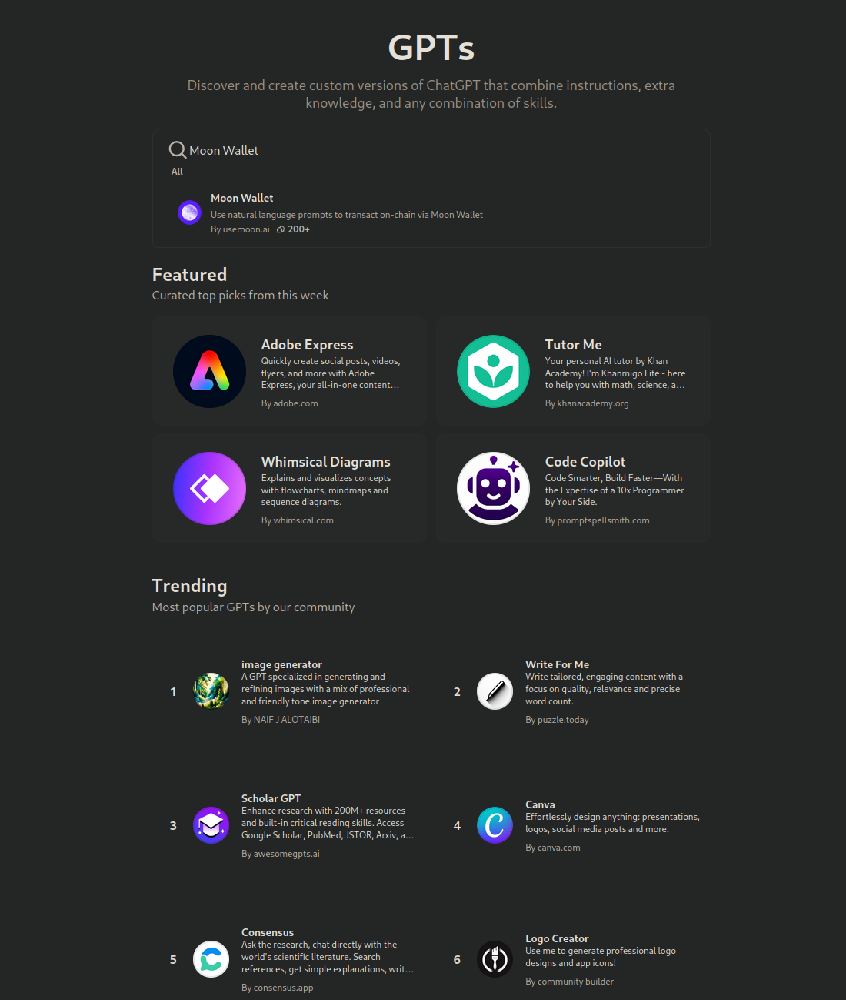

# Chat GPT

### Summary

The Moon Wallet ChatGPT Plugin integrates the powerful capabilities of the Moon Wallet infrastructure with the AI-driven functionality of ChatGPT. This plugin enables seamless interactions with blockchain wallets, providing users with a wide range of services including wallet creation, transaction signing, authentication, and more. Below, we outline the features, installation, configuration, and usage of the Moon Wallet ChatGPT Plugin.

### Usage

You can search for the moon wallet plugin on the gpt store

<figure><figcaption></figcaption></figure>

You can also access the moon wallet chatgpt plugin directly at

[https://chatgpt.com/g/g-1Ou9DoNMd-moon-wallet](https://chatgpt.com/g/g-1Ou9DoNMd-moon-wallet)
